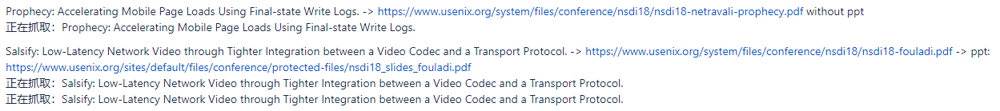

<h1 align="center"> Auto-Collect-Paper-Toolkit </h1>

    

ACPT can automatically obtain the paper address of the conference/journal in the dblp paper database, and automatically download the pdf file of the paper and the pdf file of the speech manuscript from the official conference address.

自动化收集论文工具箱，能够自动对可访问的会议或期刊官网中的收录论文进行下载，为科研工作者批量查找和下载大量论文提供便利，修改配置文件即可实现目标会议的指定年限论文集自动下载工作。

## Preview

## Install

## Usage

## Note

1. The default configuration and processing logic are designed according to the official website structure published by [USENIX](https://www.usenix.org/conferences). If you need the configuration of other journals or conference websites, there are two solutions.

    - Modify the logic yourself

    - [Submit](https://github.com/linwhitehat/ACPT4dblp/issues/new) the target conference or journal that needs to be crawled, and I will add it to the toolkit (requires free time)
    
2. The storage path is processed by layer 2 by default, such as the conference name (NSDI) under the F disk, and finally write F:/NSDI/ in the config file.

    - If you use a multi-layer path, please write the established path into the configuration file.
    
3. The version of chromedriver needs to be adapted to the current browser version.

    - View the current version of the Chrome browse, chrome://settings/help
    
    - Download the corresponding version of chromedriver, https://chromedriver.chromium.org/downloads.
    
    - If you are using Firefox browser, you can also download firefoxfdriver to replace chromedriver, please pay attention to the code adjustment at this time.
    
4. Problems.
     If your network environment is unable to access the resources on the target website, it will cause problems such as slow acquisition speed, abnormalities or errors.
     
    - Delay
    
    For example, the USENIX conference website will play a presentation video from the YouTube website, but this part of the resource is not accessible in China, so it will cause a waiting time of 2-3 minutes. Fortunately, this effect will not make the paper unavailable.
    
    - Error
    
    If you do not have access to the paper resources, you will not be able to get the complete paper.

## Guide

Waiting...

## Contributing
Feel free to dive in!
[Open new issue](https://github.com/linwhitehat/ACPT4dblp/issues/new) or submit PRs.

## License
[MIT](LICENSE) © linwhitehat
